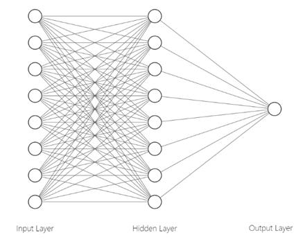
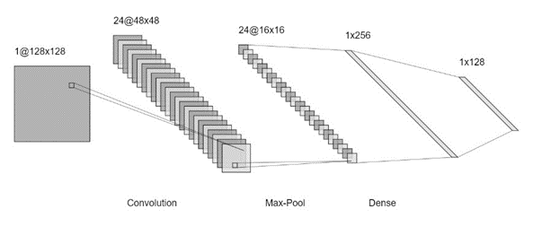
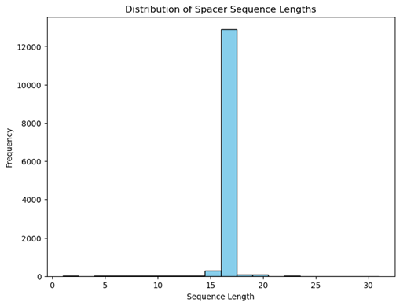
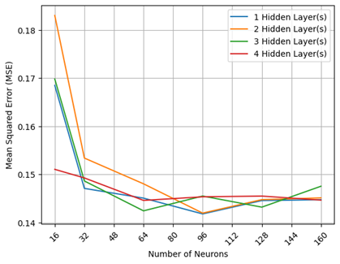
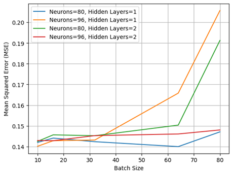

# Predictive Artificial Neural Networks for mRNA Transcriptional Profiles and Sequence Motifs

## Description

Messenger ribonucleic acid (mRNA) synthesis in all organisms is performed by the RNA polymerases, which transcribe corresponding nucleotide base pairs in a gene. The rate of mRNA synthesis is an essential parameter in gene expression. Researchers, such as Van Brempt et al. [6] and LaFleur et al.’s [5] have developed machine learning tools to predict the transcription initiation rates (TX) in E. coli based on RNAP/σ70-promoter interactions. However, there are currently no prediction tools (i) designed for sequential data, (ii) that can account for the complexity of the interplay between regions and employ a modeling method that does not assume independence between sections, and (iii) afford backward-compatible prediction of novel σ70 promoter sequences motifs given a desired TX. This project extends the current research by developing forward- and backward-compatible prediction tools to more accurately predict TX across novel σ70 promoter sequence motifs and novel sequence motifs from TX. The tool uses an artificial neural network (ANN) with a bidirectional information feed between nodes and layers, a state memory, and a multilayer cell structure. The model was optimized using hyperparameter tuning and, compared to the eminent 346-parameter multiple linear regression (MLR), has 81,845 total parameters. The LSTM is “black-boxed” and not as effective for concluding meaningful relationships using parameter analysis. However, it has a significantly lower MSE (0.1400 compared to 0.2515, a decrease of 44%). This model is also the first backward-compatible prediction model, predicting novel sequence motifs given TX, and affording synthetic engineering of non-canonical sequence motifs with desired TX. 

This research has implemented the optimized LSTM model as the back-end for two prediction tools. The first tool is similar to Van Brempt et al. [6] and LaFleur et al.’s [5] and can be used by molecular biologists to more accurately predict genetic context effects, design σ70 promoters with desired transcription rates, and identify undesired promoters inside engineered genetic systems. It works as a wrapper for the model—given a novel sequence and the model file, the tool uses the model and returns a predicted TX given the sequence.

The second tool is the first backward-compatible prediction model, returning novel sequence motifs with predicted TX closest to a desired value. This tool is more applicable in biophysics and genetic engineering as it can simulate TX of synthetic and non-canonical sequence motifs before engineering them. The tool requires two arguments (the model and desired TX) and has nine optional arguments: the desired TX tolerance, maximum returned results, maximum iterations, and all specified sequence motifs required in the output. The tool calculates every permutation of sequence motifs, predicts a TX value for each permutation, and then returns the sequences with the closest TX. This approach has a runtime of O(M * N!), where N is the sequence length, and M is the number of LSTM parameters. Future research should seek to improve this approach by hashing simulated combinations, applying an inverse transformation, or creating a specialized model. However, all of these approaches still have their respective limitations.

## Front-end: 'prediction_tool.ipynb'

See module for example uses.

### Transcription Rate Prediction

To predict the transcription rate of a novel sequence, use the `pred_trans` function from the `tool_backend.pred_tool_calc` module. This function requires the following inputs:

- `seq`: A list of DNA sequences for prediction.
- `model_path`: Path to the trained model file.

### Promoter Sequence Prediction

To predict promoter sequences closest to a target transcription rate, use the `pred_prom` function from the `tool_backend.pred_tool_calc` module. This function requires various parameters including the target rate and optional sequences.

## Back-end: tool_backend/pred_tool_calc.py

This Python module provides backend functionalities for predicting transcription rates and promoter sequences in 'prediction_tool.ipynb'. It includes functions for loading models, predicting transcription rates, and performing combinatorial predictions for promoter sequences. See module for more details.

## Other Modules:

See /comparison for details on different model approaches, including one-hot-encoding, data preprocessing, CNN, RNN, and MLR comparisons. 'main_comparison.ipynb' includes an overview of all approaches. See /tuning for steps, models, and comparison from the LSTM hyperparameter tuning.

## Introduction 
Messenger ribonucleic acid (mRNA) synthesis in all organisms is performed by the RNA polymerases, which transcribe corresponding nucleotide base pairs in a gene. In bacteria, the initiation of transcription at promoters requires a dissociable specificity subunit of RNA polymerase (RNAP) called sigma (σ) that binds to the core to form the “holoenzyme” [1]. In prokaryotes, transcription, translation, and mRNA degradation are simultaneous, while in eukaryotes, after transcription, the mRNA may be processed, edited, and transported before translation [2]. During translation, mature mRNA is transported to the ribosome, where each three-nucleotide subsequence (codon) in the coding region of mRNA is matched to an amino acid. The generated sequence of amino acids (peptide) expresses the gene as a phenotypic trait [2]. Additionally, untranslated regions (UTRs) are sections of the mRNA upstream (before) the start codon and downstream (after) the stop codon. These are not translated but serve several roles in gene expression, including mRNA stability, localization, and translational efficiency [3].

The rate of mRNA synthesis is an essential parameter in gene expression. Transcription rate encompasses two related, yet different, concepts: the nascent transcription rate, which measures the in-situ mRNA production by RNA polymerase, and the rate of synthesis of mature mRNA, which measures the contribution of transcription to the mRNA concentration [4]. In bacteria, transcription rates are regulated by the interactions between RNA polymerase, sigma factor, and promoter DNA sequences1 [5]. Recently, researchers [5], [6] have developed machine learning tools to predict the transcription initiation rates (TX) in E. coli based on RNAP/σ70-promoter interactions2. Using these models, molecular biologists can accurately predict genetic context effects, design σ70 promoters with desired transcription rates, and identify undesired promoters inside engineered genetic systems. However, despite this research, there are currently no prediction tools (i) designed for sequential data, (ii) that can account for the complexity of the interplay between regions and employ a modeling method that does not assume independence between sections, and (iii) afford backward-compatible prediction of novel σ70 promoter sequences motifs given a desired TX.

This project extends the current research by developing forward- and backward-compatible prediction tools to more accurately predict TX from across novel σ70 promoter sequence motifs and novel sequence motifs from TX. The tool uses an artificial neural network (ANN) with a bidirectional feed of information between nodes and layers and a state memory and multilayer cell structure. The model has been optimized using hyperparameter tuning and, compared to the eminent 346-parameter multiple linear regression (MLR), has 81,845 total parameters. With so many parameters, the LSTM is “black-boxed,” and not as effective for concluding meaningful relationships using parameter analysis. However, it has a significantly lower MSE (0.1400 compared to 0.25153, a decrease of 44%). This model is also the first backward-compatible prediction model, predicting novel sequence motifs given TX, and affording synthetic engineering of non-canonical sequence motifs with desired TX. 

## Literature Review
Previous attempts to model promoter strength and transcription rates based on novel DNA sequences have often targeted multiple promoter regions simultaneously. These models severely underestimate the complexity of the interplay between regions and employ modeling methods that assume independence between sections (e.g., position weight matrix), practically limiting their predictability to single nucleotide variation [6]. In response, Van Brempt et al. [6] have developed several convolutional neural networks (CNN) with high-throughput DNA sequencing data from fluorescence-activated cell-sorted promoter libraries. Their models enable forward engineering of E. coli σ70-specific promoters based on their TX4 and mutual orthogonal functioning in E. coli. Their E. coli σ70 model was validated in vivo to create the first Promoter TX Designer tool, named ProD. Their model allows 17 degrees of freedom, encompassing the complete spacer that spans the region between the −35 and −10 conserved promoter elements. 

Although Van Brempt et al.’s approach produced highly accurate “black-boxed” models, it still has four significant limitations. Firstly, CNNs are generally better suited for non-sequential and grid-structured data like images. Although they can be applied to sequential data by treating it as a one-dimensional grid, CNNs do not inherently capture sequential dependencies as effectively as RNNs [7]. Secondly, Van Brempt et al.’s models use prokaryotic promoter sequences subdivided into the conserved −35 and −10 regions, the UP element, and the spacer sequences. More recent models, including LaFleur et al.’s, include the 4-nucleotide site upstream of the −10 motif, called the −10 extended motif; the typically 6-nucleotide region in between the −10 motif and TSS, called the discriminator; and the first 20 transcribed nucleotides, called the initial transcribed region [5]. Thirdly, Van Brempt et al.’s model predicts relative promoter strength, which is less specific than those developed using LaFleur et al.’s statistical thermodynamic model of TX [5]. Lastly, they opted to classify promoter strength by dividing it into 11 ordinal classes ranging from 0 to 10, with 0-2 representing “zero to low expression,” 3-5 representing “low to medium expression,” 6-8 representing “medium to high expression,” and 9-10 representing “high to very high expression.” From a human-centered design perspective, the non-continuous classifications may not allow this tool to be precise enough for engineering synthetic genetic systems.

More recently, LaFleur et al. [5] developed a biophysical MLR model of RNAP/σ70-promoter interactions to accomplish two goals. The first is to use the model to develop a biophysical basis for understanding gene regulation in natural genetic systems and precise transcriptional control for engineering synthetic genetic systems. They analyzed the model’s parameters to understand how non-canonical and (mostly) non-coding sequence motifs collectively control transcription rates. They found that a ridge regression model with 346 fitted coefficients yielded a convergent learning curve and an R2 of 0.80. They performed ANOVA analysis to quantify how each predicted free energy term contributed to the promoters’ measured TX rates in our dataset and found that 83% of the TX rate variance could be explained by varying the interactions that control initial RNAP/σ70 recruitment, using the UP, −35, −10, −10 ext, and spacer motifs. In contrast, 7.1% of the TX rate variance was explained by differences in the interactions controlling DNA melting, R-loop formation, and promoter escape, which are affected by the Disc and ITR regions. Lastly, their model could not explain 9.9% of sequence variance. Their second goal was to use their MLR (similar to Van Brempt et al.’s model [6]) as a prediction tool with the previously stated benefits for accurate genetic engineering. 

MLRs are useful heuristic devices because they are “white-boxed,” and one can conclude correlations and relationships between a feature and an output. While LaFleur et al.’s model predictions for transcription rates have a relatively low MSE of 0.2515 [5], training a specialized “black-boxed” model (such as Van Brempt et al.’s [6]) can significantly increase the model's accuracy. These models are not as useful as MLRs for parameter analysis and understanding how non-canonical sequence motifs collectively control transcription rates. However, “black-boxed” models are useful as back-end implementations for tools for engineering synthetic genetic systems. 

## Data Collection
LaFleur et al. [5] developed 14,206 promoters with varied sequence motifs to systematically alter the interactions that affect RNAP/σ70 binding and transcriptional initiation. They made this data publicly available, including all promoter sequences, model calculations, and experimental measurements. The models developed in this research use LaFleur et al.’s data [5], training each model using the sequence motifs as input features and the transcription initiation rate as the output. 

The sequence motifs are where the RNAP/σ70 binding and transcriptional initiation occurs and are known by their canonical positions, including (i) an upstream 6-nucleotide site called the −35 motif; (ii) a 20-nucleotide region that appears upstream of the −35 motif, called the UP element; (iii) a downstream 6-nucleotide site called the −10 motif; (iv) a spacer region that separates the −10 and −35 motifs; (v) a 4-nucleotide site upstream of the −10 motif, called the −10 extended motif (−10 ext)5; (vi) a typically 6-nucleotide region in between the −10 motif and TSS, called the discriminator; and (vii) the first 20 transcribed nucleotides, called the initial transcribed region.

LaFleur et al. [5] determined the transcription initiation rate (TX) for each sequence using a statistical thermodynamic model of transcriptional initiation that accounts for competitive binding of RNAP/σ70 to all DNA and the multiple sequence contacts that control RNAP/σ70 recruitment at each promoter (Methods). Their thermodynamic model indicated they could determine how a promoter’s sequence controls the interaction energies as a sum of free energies related to the transcription initiation rate. They used log(TX/Txref) to predict a promoter’s TX rate compared to a reference promoter sequence6.

## Data Preprocessing
For the sequence motifs to be processed by the models, they needed to be converted from categorical to quantitative data [8]. To do so, each base pair was one-hot encoded and converted into a Boolean array ('A': [1,0,0,0], 'C': [0,1,0,0], 'G': [0,0,1,0], 'T': [0,0,0,1], '0': [0,0,0,0]). One-hot encoding is better suited for this data than label encoding because it does not assign weights to the processed attributes7 [9]. This application includes dummy dropping, which removes one encoded column, as this information can be determined by the results of all other known features8. Next, the sequences are concatenated and given to the model as one input. Additionally, for each model, 80% of the data is reserved for training, and 20% is reserved for testing. All models are trained on both the X training and Y training data. Given the X testing data, the models produce predicted Y values, which are compared to the Y testing data to evaluate the model using MSE.

Machine Learning Models
Artificial neural networks (ANN) are a machine learning method that evolved from simulating the human brain. They are used to develop sophisticated analysis methods by uncovering the hidden causal relationships between single or multiple responses and a large set of properties9 [10].

*Fig 1. A graphical representation of a feed-forward ANN with one 8 input features, two 8-neuron hidden layers, and one output feature layer. Figure generated by Lenail [11].*

There are several types of artificial neural networks (ANN), with two of the most common being CNNs and RNNs. CNNs were developed for image recognition and apply kernels for hierarchy and conceptual feature recognition [12][13]. Kernels are grids with optimized Boolean values multiplied against a section of the input, applying a searching process to identify the presence of features in an input. Each kernel is trained to identify one feature and together produce a layer of feature maps. This is followed by other layers, such as pooling layers, which reduce the dimensions of data by combining the outputs of neuron clusters at one layer into a single neuron in the next layer. Other layers include flattening layers, which retrieve all input features from the previous layer. Next, the input features are processed normally, though hidden fully-connected and output layers [12][13].
 

*Fig 2. A graphical representation of a CNN with one 128x128 input layer, 24 48x48 kernels, 24 16x16 pooling maps, and a dense flattening layer. Figure generated by Lenail [11].*

RNNs have a bidirectional flow of information between nodes and layers. While typical ANNs and CNNs are unidirectional, non-cyclical, and “feed-forward,” the output from some nodes in RNNs can propagate backward, affecting subsequent input to the same nodes and layers [14]. This makes RNNs particularly capable of learning features and long-term dependencies from sequential and time-series data. RNNs have a stack of non-linear units where at least one connection between units forms a directed cycle. A well-trained RNN can model any dynamical system; however, training RNNs is mainly plagued by issues in learning long-term dependencies [15]. This research uses long short-term memory (LSTM) RNNs, which have a state memory and multilayer cell structure [16], remedying the "vanishing gradient problem" present in traditional RNNs [17]. LSTM units are composed of a cell, an input gate, an output gate, and a forget gate. The cell remembers values over arbitrary time intervals, and the three gates regulate the flow of information into and out of the cell [16].

*Fig 3. A graphical representation of an RNN with a bidirectional flow of information between the first and second hidden layers [18].*

Since CNNs are better suited for hierarchical and RNNs are better suited for sequential architectures [19], I evaluated the two ANNs using the same data to characterize the sequence motifs10. Next, I applied feature optimization and hyperparameter tuning to the more accurate model, extrapolating the results from the initial models and assuming any optimization techniques would only increase the difference in MSE. I additionally planned to compare the models to an MLR, which would one-hot encode each of the six sequences as a different classification. However, this approach treats every unique sequence in each column as a separate categorical input. With a resulting 5 rows and 11942 columns, fitting an MLR model to this data would take an unrealistic amount of time and be very inaccurate11.

## Handling Varying Sequence Lengths

Only two of the six sequence motifs have fixed lengths: the −35 and −20 motifs, which have a length of six base pairs. Since LSTMs and CNNs take inputs of the same length and dimension [20], the data needs additional preprocessing to be interpreted by the algorithms. I employed two approaches in handling features to minimize the MSE. The first approach concatenated the −35 and −10 motifs to create one input. While this approach does not include 4/6 available sequences, LaFleur et al.’s ANOVA analysis found the −35 and −10 motifs are very relevant to TX, with 18% and 38% of the TX rate variance explained by varying the −35 and −10 motifs, respectively [5].

The second approach was to use all input sequences and add “padding” to standardize the lengths by adding layers of filler data outside the actual data in an input matrix. The primary purpose of padding is to preserve the spatial size of the input so that the output remains the same size or adjusts according to the desired output dimensions [21]. Padding is applied during preprocessing, and during backpropagation, the weight of padding data decreases accordingly. Reddy and Reddy (2019) found little difference in performance between pre- and post-padding in LSTMs, unlike with CNNs. However, they did find that LSTM pre-padding was marginally more accurate, so the padding was implemented upstream. Additionally, I excluded the entries with synthetic spacer sequences, which have lengths deviating from the optimal length of 17 by more than ±2 base pairs [22]. The synthetic spacer sequences vary in length from 0 to 31. They are infrequent, do not significantly increase accuracy, and drastically increase training runtime.

*Fig 4. The distribution of lengths for the spacer sequence between the −35 and −20 motifs*

## Hyperparameter Tuning

Machine learning models have hyperparameters that must be specified to customize the model to a dataset. Often, the general effects of hyperparameters on a model are known, but determining the best set of hyperparameters and combinations of interacting hyperparameters for a given dataset is challenging [23], [24]. Though there are general guides for configuring hyperparameters, a more optimal approach is hyperparameter tuning. This approach objectively searches different values for model hyperparameters and chooses a subset that results in a model that achieves the best performance on a given dataset. Two implementations for hyperparameter tuning are "randomized search" and "grid search." While grid search finds the more optimal hyperparameter, randomized search is far less time- and processing power-intensive [23].

For the best results, LSTMs should be optimized for the following hyperparameters: the variables describing the state memory and multilayer cell structure, neurons, layers, learning rate (α), batch size, and epochs [23], [24]. Changing the state memory and multilayer cell structure affects how each cell remembers values over arbitrary time intervals [16]. Increasing the number of neurons per hidden layer will increase the complexity of the model. This will improve accuracy so long as the model does not over-fit the data. Overfitting occurs when a model is too trained explicitly on training data and inaccurately predicts unseen testing data [25]. The number of hidden layers is correlated to model depth and accuracy, so long as it does not overfit the data. α is a tuning parameter in the gradient descent optimization algorithm12. It determines the step size at each iteration while moving toward a minimum loss function [26]. Increasing α will increase the model's training speed and convergence, but if it is too high, the algorithm will overstep and not converge. Batches are the samples used during each epoch to update the model's weights. Smaller batch sizes require less memory and lead to faster convergence. However, they are less accurate and stable. Each epoch is a forward and backward propagation. Too few epochs lead to underfitting; too many leads to overfitting. 

This research used a modified grid search approach to tune the hyperparameters, training models on a range of neurons (16, 32, 64, 96, 128), hidden layers (1- 4), and batch size (10, 16, 32, 64) in combination. The neurons and hidden layers parameters were optimized first, and then various batch sizes were tested with the best-performing models to further decrease MSE. I did not optimize the variables describing the state memory and multilayer cell structure, as changing the arguments from their initial values only increased the model’s MSE. I also did not optimize α, instead setting alpha to a small enough step size to ensure the models converged. Likewise, I did not optimize the number of epochs; instead, I set it to 150, a parameter high enough for all models to converge. I also used keras.callbacks.EarlyStopping to stop training when the model reached a local minimum MSE.

## Results

As expected, the CNN had a higher MSE than the LSTMs because it does not inherently capture sequential dependencies as effectively as RNNs [7]. However, compared to LaFleur et al.'s MLR model [5], both the CNN and initial LSTM models had far higher accuracy. Only including the upstream −35 and the downstream −10 motif, the CNN decreased the MSE from 0.2515 to 0.1891 (a 24.7% decrease), and the initial LSTM (trained on the same data) decreased the MSE to 0.1664 (a 33.9% decrease). After establishing the LSTM was better suited for this data, all feature optimization and hyperparameter tuning were only applied to the LSTM. Including all sequences by padding the variable-length inputs further decreased the MSE of the LSTM to 0.1450.

The grid-search hyperparameter tuning approach showed that the most accurate LSTM trained on the padded data has one hidden layer, 96 neurons per layer, and an MSE of 0.1417. It was only slightly more accurate than the model trained on two hidden layers, 96 neurons per layer, and an MSE of 0.1419. 

*Fig 5. MSE vs. Neurons for Each 1 to 4 Hidden Layers*

Due to these results, when optimizing batch size, I tested the range of values with models with one and two hidden layers and 96 neurons per layer. I also tested using 80 neurons per layer to see if the minimum MSE was higher or lower than models with 96 neurons per layer. These results show that the optimal combination is one hidden layer, 80 neurons per layer, and a batch size of 64. This model has an MSE of 0.1400. 

*Fig 6. Batch Size vs MSE for Different Combinations of Neurons and Hidden Layers*

Compared to LaFleur et al.’s 346-parameter model [5], the optimized LSTM has 81,845 total parameters (27,281 trainable and 54,564 optimizer parameters). The architecture and configuration of the network determine the number of trainable parameters in a neural network model [27]. This includes the connections in each neuron between layers and the biases in every layer, and are based on the input shape, the number of hidden layers, the neurons for each hidden layer, and the output shape. All models (using the padded data) have an input shape of 82x4 (82 base pairs represented by 4-long Boolean arrays) and an output shape of one continuous value representing TX. The optimized model’s parameters also include one hidden layer and 80 neurons per hidden layer. The batch size, epochs, and α are only used in training the model. The total parameters also include the bias terms and recurrent connections. In all ANN models, the number of parameters is an important metric for understanding the model's capacity and complexity. Optimizing density and the number of parameters of each layer helps deter overfitting and underfitting [28].

The grid search optimization showed that non-optimized models often suffered from underfitting. The model with the highest MSE (0.1830) before batch size optimization had two hidden layers and 16 neurons per layer. It had 10,421 total parameters. However, this research does not explore overly dense models with more parameters because they are costly, and the tuning showed that the optimal combinations of hyperparameters were low. If models with more hidden layers and neurons were fit to the trained data, we would expect them to overfit and produce inaccurate predictions given the testing data.

## Conclusion and Discussion

This research expanded on prior research by Van Brempt et al. [6] and LaFleur et al. [5], which developed forward-compatible prediction tools to accurately predict transcription initiation rates across novel RNAP/σ70 promoter sequence motifs. LaFleur et al. [5] sought to develop a biophysical MLR model of RNAP/σ70-promoter interactions to accomplish two goals. The first was to use the model to develop a biophysical basis for understanding gene regulation in natural genetic systems and precise transcriptional control for engineering synthetic genetic systems. They analyzed their MLR’s parameters to understand how non-canonical and (mostly) non-coding sequence motifs collectively control transcription rates. Their second goal was to use their MLR to predict genetic context effects accurately, design σ70 promoters with desired transcription rates, and identify undesired promoters inside engineered genetic systems. Their model’s predictions for transcription initiation rate (TX) had an MSE of 0.2515 or 9.7% of the average TX. Additionally, their model could explain 90.1% of the TX variance using the presence of three-nucleotide sequences within hexamers. These determine the varying interactions that control initial RNAP/σ70 recruitment, using the UP, −35, −10, −10 ext, and spacer motifs, as well as the differences in the interactions controlling DNA melting, R-loop formation, and promoter escape, which are affected by the Disc and ITR regions.

Before LaFleur et al.'s [5] research, Van Brempt et al. [6] sought to develop “back-boxed” models to predict TX. They developed several CNNs, which predict promoter strength and TX while accounting for the complexity of the interplay between regions by employing a modeling method that does not assume independence between sections. However, Van Brempt et al.’s [6] approach still has four significant limitations. These are that they used CNNs instead of RNNs, did not consider all of the sequence motifs that LaFleur et al. [5] did, considered relative promoted strength instead of a statistical thermodynamic model of TX, and classified promoted strength as categorical outputs.

Extending LaFleur et al. [5] and Van Brempt et al.'s [6] research, I have developed forward- and backward-compatible prediction tools to more accurately predict TX from across novel σ70 promoter sequence motifs and novel sequence motifs from TX. The tool uses an LSTM ANN, which includes a bidirectional feed of information between nodes and layers, state memory, and multilayer cell structure. The model has been optimized using hyperparameter tuning for the number of hidden layers, neurons per hidden layer, and batch size. Compared to LaFleur et al.’s eminent 346-parameter MLR [5], this LSTM has 81,845 total parameters. With so many parameters, the LSTM is “black-boxed” and not as effective for concluding meaningful relationships using parameter analysis. However, it has a significantly lower MSE (0.1400 compared to 0.2515, a decrease of 44%). This model is also the first backward-compatible prediction model, predicting novel sequence motifs given TX, and affording synthetic engineering of non-canonical sequence motifs with desired TX. Using this improved tool, molecular biologists can more accurately predict genetic context effects, design σ70 promoters with desired transcription rates, and identify undesired promoters inside engineered genetic systems.

## Future Work

Although LSTMs are not as effective for concluding meaningful relationships using parameter analysis, one can still learn from them. Future research should seek to use the more accurate LSTM to clarify how non-canonical sequence motifs collectively control transcription rates. Further building off of LaFleur et al.’s research [5], this future scope may reveal new relationships between base pairs across non-canonical sequence motifs and further develop the understanding of how they collectively control transcription rates. Techniques such as an ANOVA analysis to quantify how each predicted free energy term contributed to the promoters’ measured TX rates can be used to compare the analysis of the optimized LSTM with LaFleur et al.’s MLR [5]. Similar techniques can be applied to Van Brempt et al.’s [6] for a comprehensive comparison. Future work should also explore the analysis of diffusion models and feature detection in CNNs, which may apply for understanding how sequence motifs collectively control transcription rates. 

Additionally, though this research does compare the difference in accuracy between CNNs and LSTMs trained on the same data, this is not a comprehensive comparison. The parameters used for this step were general rules for specifying parameters, but this research did not optimize the CNN’s parameters. It relies on the idea that CNNs cannot capture sequential dependencies as effectively as RNNs [7]. Though DNA is generally considered sequential, CNNs feature detection using kernels may be better suited for determining σ70 binding rates. To comprehensively compare CNNs to LSTMs for this data, future work should optimize a CNN to the highest accuracy. This research did not optimize the CNN’s hyperparameters because it would have been time- and computationally expensive. Additionally, it would be highly unlikely and contest the established research on CNNs and LSTMs for the optimized CNN to be more accurate than the optimized LSTM. However, this future research may reveal new combinations of models similar to recurrent convolutional neural networks used for sequential recommendations [29].

The LSTM was optimized using a modified grid-search technique. It did not include all permutations of parameter values nor did it tune the variables describing the state memory and multilayer cell structure. Future work should explore these optimizing techniques to further decrease the model's MSE.

Lastly, future research should explore how the forward- and backward-compatible prediction tools developed in this research can be improved. Given a more extensive database, both tools could predict more accurate results by referencing in vivo TX. The backward-compatible prediction tool has a runtime of O(M * N!), where N is the sequence length, and M is the number of LSTM parameters. The tool calculates every permutation of sequence motifs, makes predictions for each, then returns the closest sequences. Future research should seek to improve this approach by hashing simulated combinations, applying an inverse transformation, or creating a specialized model. However, all of these approaches still have their respective limitations.

## Notes

1 *In eukaryotic evolutionary development (evo-devo), the transcription rate, initialization for transcription, and what genes totipotent cells express and at what rates depend on the signals they receive from neighboring cells. That is, development is a generative program, not a descriptive one [30]*

2 *In E. coli, the σ70 (RpoD) class includes the housekeeping sigma factor (Group 1), which directs the bulk of transcription during active growth, and structurally-related alternative sigma factors (Groups 2–4) that control a wide variety of adaptive responses such as morphological development and the management of stress [1].*

3 *This is a biased measurement as it evaluates the error of trained and testing data. The comparable MSE for only testing data would be higher. With an average observed transcription rate (log(TX/Txref)) of -2.436, a MSE of 0.2515 is a margin of 9.7%.*

4 *Van Brempt et al. [6] have technically created a CNN for forward engineering of promoter transcription initiation frequency (TIF). However, TIF is a comparable measurement to LaFleur et al.’s [5] transcription initiation rate (TX).*

5 *The −10 extended motif was not included in LaFleur et al.’s publicly available data, so all models in this research were trained without it. However, according to LaFleur et al.’s ANOVA analysis, only 10% of the TX rate variance could be explained by varying the interactions that control this sequence [5].*

6 *This is not an exhaustive summary. For more details, see the “Model formulation and library design” section of LaFleur et al.’s paper [5].*

7 *While one-hot encoding creates a new column for the presence of an attribute, label encoding converts categorical features into numerical data ranging from 0 to n-1, where is the number of attributes.*

8 *For the model comparison, see: https://github.com/Rhys-sg/promoter-sequence-transcription-rates/tree/main/tuning*

9 *An ANN’s structure simulates a brain’s neural network—a web of interconnected neurons that are millions in number. ANNs have three-layer structures: (i) the input layer, which contains one or more input features; (ii) the fully-connected hidden layer(s), which contains the neurons; and (iii) the output layer, which contains one or more output features. Each node in a layer is connected to the nodes in the next layer.  In forward propagation, the output of each node is multiplied by a weight, and the sum of all weights in a layer is given as the input to the activation function in each node in the next layer. This research uses a standard rectified linear unit (ReLU) function [31]. The activation function produces an output, and the process repeats for every layer in the ANN. In backward propagation, the predicted results are compared to the true results, and based on the difference, the weights inside the ANN are adjusted accordingly. One forward and backward propagation is an epoch.*

10 *Both the LSTMs and CNN use keras.models.Sequential to group a linear stack of layers into a model (Keras Team, n.d.). They also use keras.layers.Conv1D, MaxPooling1D, Flatten, and Dense to specify the appropriate input, hidden (dense), and output layers for LSTMs, and input, convolutional, pooling, fully connected (dense), and output layers for the CNN.*

11 *For initial code, see: https://github.com/Rhys-sg/promoter-sequence-transcription-rates/blob/main/main.ipynb*

12 *These models were trained using Adam optimization algorithm, an extension to stochastic gradient descent that has recently seen broader adoption for deep learning applications in computer vision and natural language processing [32].*

## References

[1]	M. Paget, “Bacterial Sigma Factors and Anti-Sigma Factors: Structure, Function and Distribution,” Biomolecules, vol. 5, no. 3, pp. 1245–1265, Jun. 2015, doi: https://doi.org/10.3390/biom5031245.

[2]	OpenStax CNX, “15.2: Prokaryotic Transcription,” Biology LibreTexts, Nov. 02, 2015. https://bio.libretexts.org/Bookshelves/Introductory_and_General_Biology/General_Biology_1e_(OpenStax)/3%3A_Genetics/15%3A_Genes_and_Proteins/15.2%3A_Prokaryotic_Transcription[3]	C. Mayr, “What Are 3’ UTRs Doing?,” Cold Spring Harbor Perspectives in Biology, vol. 11, no. 10, Oct. 2019, doi: https://doi.org/10.1101/cshperspect.a034728.

[4]	J. E. Pérez-Ortín, D. A. Medina, S. Chávez, and J. Moreno, “What do you mean by transcription rate?,” BioEssays, vol. 35, no. 12, pp. 1056–1062, Sep. 2013, doi: https://doi.org/10.1002/bies.201300057.

[5]	T. L. LaFleur, A. Hossain, and H. M. Salis, “Automated model-predictive design of synthetic promoters to control transcriptional profiles in bacteria,” Nature Communications, vol. 13, no. 1, Sep. 2022, doi: https://doi.org/10.1038/s41467-022-32829-5.

[6]	M. Van Brempt et al., “Predictive design of sigma factor-specific promoters,” Nature Communications, vol. 11, no. 1, Nov. 2020, doi: https://doi.org/10.1038/s41467-020-19446-w.

[7]	K. O’Shea and R. Nash, “An Introduction to Convolutional Neural Networks,” arXiv:1511.08458 [cs], Dec. 2015, Available: https://arxiv.org/abs/1511.08458

[8]	A. Fawcett, “Data Science in 5 Minutes: What is One Hot Encoding?,” Educative: Interactive Courses for Software Developers, Feb. 11, 2021. https://www.educative.io/blog/one-hot-encoding

[9]	A. Chugh, “ML | Label Encoding of datasets in Python,” GeeksforGeeks, Oct. 15, 2018. https://www.geeksforgeeks.org/ml-label-encoding-of-datasets-in-python/

[10]	J. Zou, Y. Han, and S.-S. So, “Overview of Artificial Neural Networks,” Methods in Molecular BiologyTM, vol. 458, pp. 14–22, 2008, doi: https://doi.org/10.1007/978-1-60327-101-1_2.

[11]	A. Lenail, “Publication-ready NN-architecture schematics.,” alexlenail.me, May 19, 2018. https://alexlenail.me/NN-SVG/

[12]	D. Bhatt et al., “CNN Variants for Computer Vision: History, Architecture, Application, Challenges and Future Scope,” Electronics, vol. 10, no. 20, p. 2470, Oct. 2021, doi: https://doi.org/10.3390/electronics10202470.

[13]	L. Alzubaidi et al., “Review of deep learning: concepts, CNN architectures, challenges, applications, future directions,” Journal of Big Data, vol. 8, no. 1, Mar. 2021, Available: https://journalofbigdata.springeropen.com/articles/10.1186/s40537-021-00444-8

[14]	R. M. Schmidt, “Recurrent Neural Networks (RNNs): A gentle Introduction and Overview,” arXiv:1912.05911 [cs, stat], Nov. 2019, Available: https://arxiv.org/abs/1912.05911

[15]	H. Salehinejad, S. Sankar, J. Barfett, E. Colak, and S. Valaee, “Recent Advances in Recurrent Neural Networks,” arXiv:1801.01078 [cs], Feb. 2018, Available: https://arxiv.org/abs/1801.01078

[16]	K. Smagulova and A. P. James, “A survey on LSTM memristive neural network architectures and applications,” The European Physical Journal Special Topics, vol. 228, no. 10, pp. 2313–2324, Oct. 2019, doi: https://doi.org/10.1140/epjst/e2019-900046-x.

[17]	Y. Hu, A. Huber, J. Anumula, and S.-C. Liu, “Overcoming the vanishing gradient problem in plain recurrent networks,” arXiv:1801.06105 [cs], Jul. 2019, Available: https://arxiv.org/abs/1801.06105

[18]	P. S. Muhuri, P. Chatterjee, X. Yuan, K. Roy, and A. Esterline, “Using a Long Short-Term Memory Recurrent Neural Network (LSTM-RNN) to Classify Network Attacks,” Information, vol. 11, no. 5, p. 243, May 2020, doi: https://doi.org/10.3390/info11050243.

[19]	W. Yin, K. Kann, M. Yu, and H. Schütze, “Comparative Study of CNN and RNN for Natural Language Processing,” Feb. 2017. Available: https://arxiv.org/pdf/1702.01923.pdf

[20]	M. D. Reddy and N. V. S. Reddy, “Effects of padding on LSTMs and CNNs,” arXiv:1903.07288 [cs, stat], Mar. 2019, Available: https://arxiv.org/abs/1903.07288 

[21]	DeepAI, “Padding (Machine Learning),” DeepAI, May 17, 2019. https://deepai.org/machine-learning-glossary-and-terms/padding

[22]	A. Typas and R. Hengge, “Role of the spacer between the -35 and -10 regions in sigmas promoter selectivity in Escherichia coli,” Molecular Microbiology, vol. 59, no. 3, pp. 1037–1051, Feb. 2006, doi: https://doi.org/10.1111/j.1365-2958.2005.04998.x.

[23]	J. Brownlee, “Hyperparameter Optimization With Random Search and Grid Search,” Machine Learning Mastery, Sep. 13, 2020. https://machinelearningmastery.com/hyperparameter-optimization-with-random-search-and-grid-search/

[24]	R. Bardenet, M. Brendel, B. Kégl, and M. Sebag, “Collaborative hyperparameter tuning,” proceedings.mlr.press, May 13, 2013. https://proceedings.mlr.press/v28/bardenet13.html

[25]	Elite Data Science, “Overfitting in Machine Learning: What It Is and How to Prevent It,” EliteDataScience, Sep. 07, 2017. https://elitedatascience.com/overfitting-in-machine-learning

[26]	Rahuljha, “LSTM Gradients,” Medium, Jun. 29, 2020. https://towardsdatascience.com/lstm-gradients-b3996e6a0296

[27]	Ryan T. J. J., “LSTMs Explained: A Complete, Technically Accurate, Conceptual Guide with Keras,” Analytics Vidhya, Sep. 10, 2021. https://medium.com/analytics-vidhya/lstms-explained-a-complete-technically-accurate-conceptual-guide-with-keras-2a650327e8f2

[28]	R. Karim, “Counting No. of Parameters in Deep Learning Models by Hand,” Medium, Dec. 04, 2019. https://towardsdatascience.com/counting-no-of-parameters-in-deep-learning-models-by-hand-8f1716241889

[29]	C. Xu et al., “Recurrent Convolutional Neural Network for Sequential Recommendation,” The Web Conference, May 2019, doi: https://doi.org/10.1145/3308558.3313408.

[30]	A. Nair, P. Chauhan, B. Saha, and K. F. Kubatzky, “Conceptual Evolution of Cell Signaling,” International Journal of Molecular Sciences, vol. 20, no. 13, p. 3292, Jul. 2019, doi: https://doi.org/10.3390/ijms20133292.

[31]	J. He, L. Li, J. Xu, and C. Zheng, “Relu Deep Neural Networks and Linear Finite Elements,” Journal of Computational Mathematics, vol. 38, no. 3, pp. 502–527, Jun. 2020, doi: https://doi.org/10.4208/jcm.1901-m2018-0160.

[32]	J. Brownlee, “Gentle Introduction to the Adam Optimization Algorithm for Deep Learning,” Machine Learning Mastery, Jul. 02, 2017. https://machinelearningmastery.com/adam-optimization-algorithm-for-deep-learning/

## Data Availability

All models trained on the data from ["Automated model-predictive design of synthetic promoters to control transcriptional profiles in bacteria"](https://www.nature.com/articles/s41467-022-32829-5) (LaFleur et al.).
